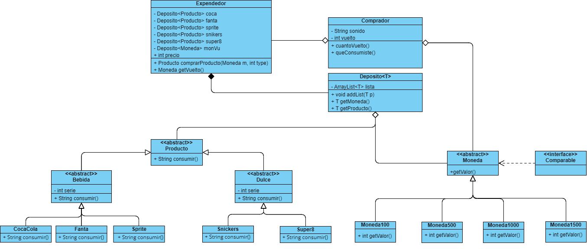

# Tarea-1-DOO
El código consiste en un expendedor de bebidas y dulces, el cual consiste con una entrada para monedas y un selector
numérico para elegir el producto. Cada vez que se le ingrese una moneda y un número, el expendedor retornará el producto
si se realizó correctamente la compra. El comprador será el que compra los productos y los consume.

## Autores
- Daniel Ignacio Aburto Rivera ([@daaburto](https://github.com/daaburto))
- Joaquín Hernán Sandoval Reyes ([@joaqsandoval04](https://github.com/joaqsandoval04))